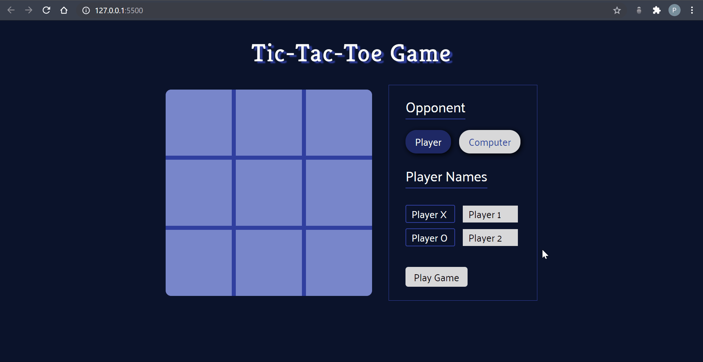

# Tic-Tac-Toe Game

An online version of a classic [tic-tac-toe](https://en.wikipedia.org/wiki/Tic-tac-toe) game played by 2 players, created using HTML5, CSS3/SCSS, and JavaScript ES6. Start playing with your friends by [visiting the site here](https://pa-aggarwal.github.io/tic-tac-toe/).

Recorded using [ScreenToGif](https://www.screentogif.com/).

## Features

* Play against another player or the computer
* Enter both player's names for checking who wins

## Learning Objectives

* Implementing code which follows single-responsibility and separation of concerns principles
* Using the module (revealing module) design pattern with [IIFE](https://developer.mozilla.org/en-US/docs/Glossary/IIFE) to create private variables/functions
* Creating objects with the factory design pattern

## Acknowledgement

This project was inspired by [The Odin Project](https://www.theodinproject.com/home) online learning curriculum.

## License

* [MIT License](https://opensource.org/licenses/MIT)
* Copyright &copy; 2020 Priya Aggarwal

